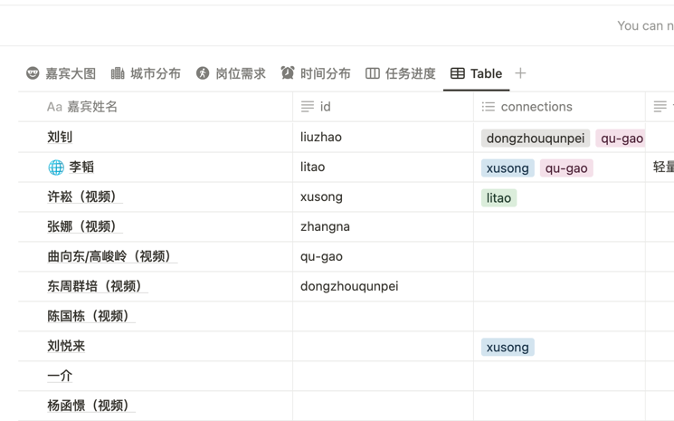
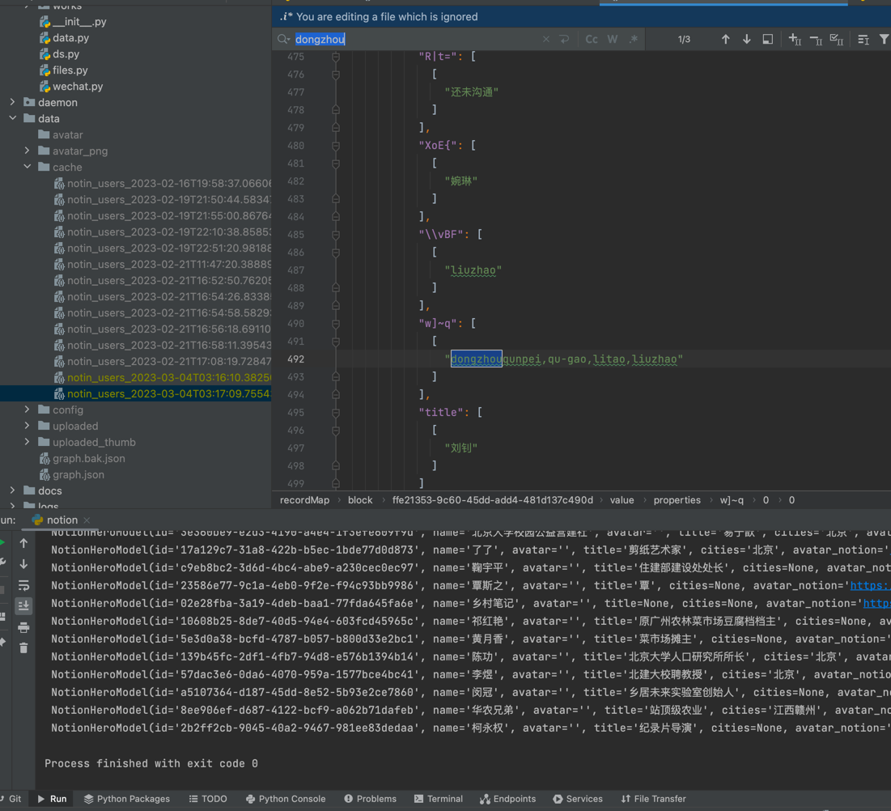
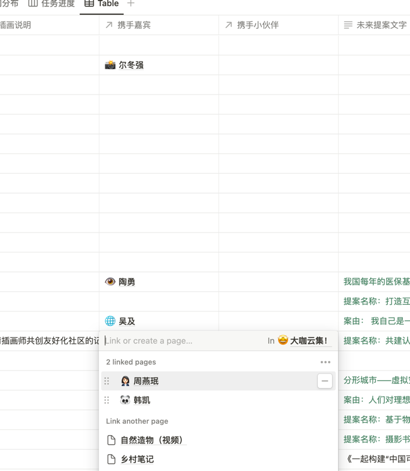

# hand-future-frontend

## todo

## screenshots

### 01. home page


### 02. album page


### 03. detail page


### 04. card page


## next.js relative

### Getting Started

First, run the development server:

```bash
npm run dev
# or
yarn dev
# or
pnpm dev
```

Open [http://localhost:3000](http://localhost:3000) with your browser to see the result.

You can start editing the page by modifying `app/page.tsx`. The page auto-updates as you edit the file.

[API routes](https://nextjs.org/docs/api-routes/introduction) can be accessed
on [http://localhost:3000/api/hello](http://localhost:3000/api/hello). This endpoint can be edited
in `pages/api/hello.ts`.

The `pages/api` directory is mapped to `/api/*`. Files in this directory are treated
as [API routes](https://nextjs.org/docs/api-routes/introduction) instead of React pages.

This project uses [`next/font`](https://nextjs.org/docs/basic-features/font-optimization) to automatically optimize and
load Inter, a custom Google Font.

### Deploy on Vercel

The easiest way to deploy your Next.js app is to use
the [Vercel Platform](https://vercel.com/new?utm_medium=default-template&filter=next.js&utm_source=create-next-app&utm_campaign=create-next-app-readme)
from the creators of Next.js.

Check out our [Next.js deployment documentation](https://nextjs.org/docs/deployment) for more details.

## tips

### 携手 notion 解析

开始先试着在notion中设置id字段，然后研究connections的形态。

然后发现，可以使用 multi-select，得到如下结果：



经过测试，后台确实可解析，结果是用英文逗号分隔的字符串，很标准。



接着，发现，我们的notion中已经有了链接字段了，不过是以 page 的entity链接的：



查看后台数据schema如下：


### 打开新的链接

```ts
// a1: open in current tab
router.push(getHeroRoute(node.id))

// a2: open in new tab, @see: https://www.js-craft.io/blog/open-link-new-tab-react/#opening-a-new-tab-at-onclick-in-react
window.open(getHeroRoute(node.id), '_blank', )
```

### `tabIndex={0} role='button'`

这个不可以用在 label 上，div 可以。

### `img` or `Image`

同一个微信图片url，普通 img tag 无法加载，nextjs 可以

nextjs/image 会先把图片用后端手段拉到本地，再从本地读取，避免了 CORS

所以尽量用 nextjs/image 提供的 Image tag，还是挺方便的

不过也有要注意的 side effect

Image 会强制你确定图片的 dimension，这是因为它要对图像大小做优化

这导致大小确定有问题时，会有一些 bizarre现象

### `react-idle-timer`

```shell
npm config set registry "http://registry.npmjs.org"
```

see: https://stackoverflow.com/a/72178549/9422455

### monaco-editor typescript support

```ts
import Editor from '@monaco-editor/react'

import type * as monaco from 'monaco-editor/esm/vs/editor/editor.api'

export type Editor = monaco.editor.IStandaloneCodeEditor
```

### 翻墙！ use my own clash config

1. create clash-scope dir: `mkdir clash && cd clash`
2. download clash (or sync with local if unable to visit foreign
   nets): `wgeet https://github.com/Dreamacro/clash/releases/download/v1.13.0/clash-linux-386-v1.13.0.gz`
3. unzip clash `gunzip clash* `
4. rename clash `mv clash* clash`
5. grant permission: `sudo chmod +x clash`
6. copy local clash config files to here, including: `config.yaml`,  `Country.mmdb`, `Rules`, `cache.db`
7. start: `sudo clash -d .` (attention: since the absence of web communication, using `-f CONFIG_FILE` would fail)
8. config it to be a daemon service

- ref :https://medium.com/@benmorel/creating-a-linux-service-with-systemd-611b5c8b91d6

```shell
sudo cp clash /usr/local/bin
sudo vim /etc/systemd/system/clash.service
systemctl start clash
systemctl enable clash # auto-start when boot
systemctl status clash
```

- file:

```text
[Unit]
Description=clash
After=network.target
StartLimitIntervalSec=0
[Service]
Type=simple
Restart=always
RestartSec=1
User=root
ExecStart=/usr/local/bin/clash -d /root/hand-future-frontend/external/clash

[Install]
WantedBy=multi-user.target
```

### generate card

https://www.npmjs.com/package/html-to-image
https://www.npmjs.com/package/htmltocanvas

https://stackoverflow.com/questions/5534128/converting-html-to-svg-using-javascript-jquery
https://www.hiqpdf.com/demo/ConvertHtmlToSvg.aspx
http://html2canvas.hertzen.com/configuration

https://docs.htmlcsstoimage.com/

### 3d-force-graph

good example can be found
at: https://codesandbox.io/s/nextjs-typescript-react-force-graph-3d-forked-cmq2n?file=/src/FocusGraph.tsx:114-131

### canvas

`react-canvas` is not suitable for our project.

```text
 WARN  Issues with peer dependencies found
.
└─┬ react-canvas
  └── ✕ unmet peer react@^15.0.0: found 18.2.0

```

## bugfix

### install `sharp` for nextjs production image optimization as suggested to

ref: https://stackoverflow.com/a/73585638/9422455

```shell
sudo apt-get update
sudo apt-get -y install libvips-dev
npm rebuild sharp
sudo npm install sharp
```

### solved: `Extra attributes from the server: class`

这是由于插件引起的，例如我使用了 Liner，它会在 react 页面渲染完成之前尝试修改 dom，因此导致 hydration mismatch

参见：https://stackoverflow.com/a/74294741/9422455

同样，另一个插件「迅雷下载支持」触发了另一个
warning：`Uncaught (in promise) TypeError: Cannot read properties of null (reading '2')`

## finished todo

- [x] [ignored] 目前字体逻辑倒是走通了，也理解了从网络或者本地加载字体的不同方式，唯一不能确认的是，既然nextjs已经基于导入的方式获得了字体，并可以填入class中，那是否意味着
  tailwindcss.config.js 中不需要再额外 explicitly 写 font 的 class 呢？ 核心参考：
    - https://nextjs.org/docs/basic-features/font-optimization#with-tailwind-css
    - https://nextjs.org/docs/api-reference/next/font#applying-styles
- [x] [ignored] 在html转image时，需要访问该node下的所有html资源，但是会在有中文文件名时（由于转义）无法匹配，所以需要在后端兼容中文的路径查找
    - 这个问题最终好像不是因为中英文，而是CORS，因为资源默认是 Annoymous 的 tag
- [x] [ignored] 思考生成的卡片宽度溢出问题（ios 375，目前宽度360，加上padding就溢出了）
    - 同下
- [x] [solved] render html to image with svg
    - 这个需求可以考虑使用 `html-to-image` 这个库，不过用这个库也有不少的坑
    - 首先最好目标网页里的图片都是本地的，否则可能有 CORS 问题 （用 `img` 与 `Image` 可能会导致不一样的结果）
    - 其次要明确写入 `pixelRatio` 参数，实测设置为 4 会得到分辨率尚可的图，否则就会视浏览器性能自动决定了
    - todo: 当然这个库最终还是存在某些浏览器无法成功截图的可能，例如手机端，似乎就不行
- [x] [ignored] sort out the best practice between global and page layout
    - 这个问题源自一开始使用的是 NextJS13，它的新特性 `app` dir
    - 后来根据官网建议不要在生产环境中使用 dev 版本，因此就不需要考虑这个问题了
    - 再后来，我向其他项目学习，是把 `components` 分成 `layouts | shared | spces` 三类，感觉很合理
- [x] [understood] auto upload package.json
    - Jetbrains里的文件必须是在IDE中手动打开修改后，才会被检测到改动，从而在保存时触发自动上传功能
    - 而`package.json`则一般会在我使用`npm/yarn`后自动更新里面的内容，因此不会触发这个机制，所以这个问题暂时无解
    - 最好的办法可能就是写一个 `rsync` 脚本了
- [x] [solved] iOS 手机上传照片
    - 这个只需要设置 `input type='file' accept='image/*'` 即可，注意是 `image/*` 而不是 `images/*`，之前写错，调了好久
- [x] [solved] use layout in app/layout.js
    - 参考：https://beta.nextjs.org/docs/rendering/server-and-client-components#third-party-packages
    - 由于第三方包（例如我的MUI）对 SSR 的兼容还不到位，因此需要用 `"use client"`
